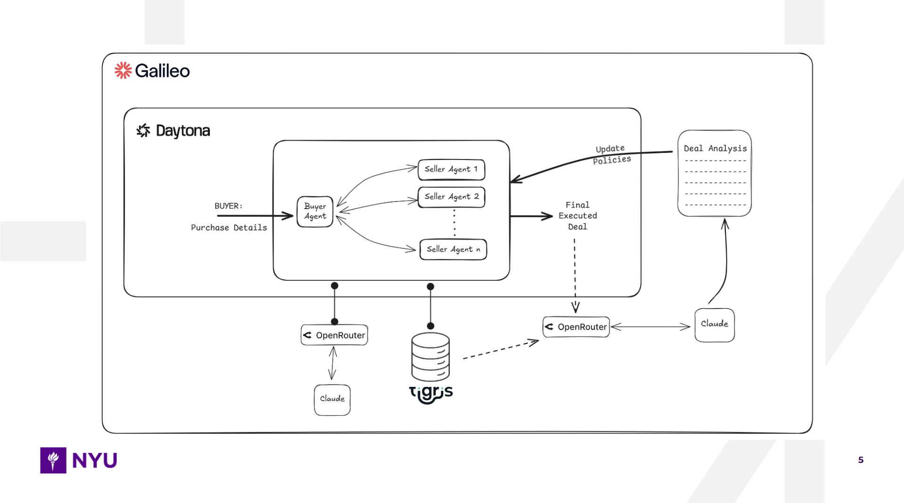

# Arbitrage

**A multi-agent marketplace that models real-world buyer–seller negotiations to get the best possible outcome for both sides.**

🏆 **Winner of Qualcomm Edge AI Track and Visa Challenge Track at HackNYU**  
🏆 **Best Use of Galileo at Daytona Hack Sprint NYC**

---

## Overview

Arbitrage is a secure, closed environment where buyer and seller agents negotiate on your behalf. The system simulates realistic market behavior by creating multiple seller agents, each with unique inventory, personality traits, and pricing policies. Through multi-round negotiations, the system executes deals while documenting trade-offs discovered during negotiation.

### Problem Statement

Getting the best deal in a competitive market is extremely hard. Buyers can't realistically discover every seller or negotiate endlessly with all of them. Similarly, sellers can only tap into a fraction of the market and cannot pitch to every qualified buyer.

### Solution Architecture

Arbitrage creates a simulated marketplace where:

- **One buyer agent** negotiates with **up to 10 seller agents** simultaneously
- Each seller has unique inventory, pricing strategies, and personality traits
- Negotiations are **opaque**—buyers don't know seller costs or internal strategies
- All decisions are **LLM-driven** with no handcrafted scoring functions
- Complete audit trail of all negotiations and decisions
- **Sandboxed execution** for secure, isolated agent environments
- **Complete negotiation logs** stored for deep analysis and policy updates
- **Observability pipeline** for tracking agent behavior and strategy shifts

---

## System Architecture

Arbitrage supports dual deployment architectures to serve both B2B and B2C needs:



### Core Components

**Daytona (Galileo System):**
- **Sandboxing:** Each product chat runs in isolated Daytona sandboxes for every negotiation simulation
- **Security:** Clean, isolated environments make multi-agent simulations reproducible and safer to test
- **Reproducibility:** Enables consistent debugging and testing under tight time constraints

**Tigris Storage:**
- **Complete Negotiation Logs:** Stores entire negotiation chats with every buyer ↔ seller message across all rounds
- **Deep Analysis:** Enables Claude to perform comprehensive deal analysis, richer policy evaluation, and accurate agent tuning
- **Historical Context:** Full conversation history for learning and optimization

**Galileo Observability:**
- **Multi-Agent Tracking:** Round-by-round conversation monitoring
- **Strategy Visualization:** Track shifts in negotiation strategy over time
- **Policy Updates:** Inspect policy updates flowing back to seller agents
- **Parameter Monitoring:** Monitor which agent parameters were updated and why
- **Learning Pipeline:** Foundation for agents to learn over time through batch simulations

### On-Device Architecture

**For B2B teams prioritizing privacy and offline capability:**

- **Hardware:** Qualcomm Snapdragon X Elite
- **Inference:** LM Studio with Qwen3-1.7B model
- **Acceleration:** NPU/GPU/CPU hybrid acceleration
- **All agents run locally** with no cloud dependency
- **Provider:** Local model inference using Qwen3 inside LM Studio with NPU acceleration

### Cloud Architecture

**For B2C use cases with flexible cloud requirements:**

- **Orchestration:** OpenRouter for hybrid reasoning
- **Models:** Gemini and Claude via OpenRouter
- **Deal Analysis:** OpenRouter + Gemini for post-negotiation analysis
- **Feedback Loop:** Policy updates based on deal analysis orchestrated via OpenRouter
- **Hybrid Reasoning:** Combines multiple models for optimal decision-making

---

## Technology Stack

### Backend

- **Framework:** FastAPI 0.104+
- **Orchestration:** LangGraph + LangChain for multi-agent conversations
- **Database:** SQLite 3 with SQLAlchemy ORM
- **LLM Providers:**
  - **On-Device:** LM Studio (Qwen3-1.7B) with NPU acceleration
  - **Cloud:** OpenRouter (Gemini, Claude) for hybrid reasoning
- **Streaming:** Server-Sent Events (SSE) for real-time updates
- **Validation:** Pydantic v2
- **Sandboxing:** Daytona for secure code execution environments
- **Storage:** Tigris Data for complete negotiation log persistence
- **Observability:** Galileo AI for LLM evaluation and monitoring

### Frontend

- **Framework:** Next.js 14+ (App Router)
- **Styling:** Tailwind CSS
- **State Management:** Zustand
- **Real-time:** EventSource API (SSE)

---

## Key Features

### Core Capabilities

- ✅ **Multi-Agent Negotiations:** One buyer vs. multiple sellers (up to 10)
- ✅ **Opaque Opponent Models:** Buyers only see what sellers choose to reveal (and vice versa)
- ✅ **LLM-Driven Reasoning:** No handcrafted scoring—pure LLM decision-making
- ✅ **Real-time Streaming:** Live negotiation updates via SSE
- ✅ **Session Persistence:** Database-backed state for multiple negotiation runs
- ✅ **Per-Item Constraints:** Independent min/max pricing per item (no global budget)
- ✅ **Sandboxed Execution:** Isolated environments for each negotiation simulation
- ✅ **Complete Logging:** Full negotiation history stored in Tigris for analysis
- ✅ **Observability:** Round-by-round tracking with Galileo for strategy analysis

### Agent Behaviors

**Buyer Agent:**
- Per-item price constraints (min/max)
- @mention-based seller targeting
- LLM-driven decision making
- No knowledge of seller internals
- Pure conversational reasoning within constraints

**Seller Agents:**
- Unique inventory and pricing policies
- Configurable personalities (rude ↔ very sweet)
- Priority strategies (profit maximization ↔ customer retention)
- Internal cost/least-price constraints (hidden from buyer)
- Behavioral weights for style and priorities

### Negotiation Flow

```
Buyer Message → Message Routing (@mentions) → Seller Responses (parallel)
    ↓
Decision Check → [Accept/Reject/Continue] → Final Deal
    ↓
Deal Analysis (Claude/Gemini) → Policy Updates (feedback loop)
    ↓
Galileo Observability → Strategy Tracking & Parameter Updates
```

### Message Visibility

- **Buyer sees:** All seller messages, own constraints, seller names only
- **Sellers see:** Buyer messages mentioning them, own inventory/pricing
- **Hidden from buyer:** Seller costs, least prices, internal strategies
- **Observability:** Galileo tracks all interactions for analysis and learning

### Feedback Loop & Learning

- **Deal Analysis:** Post-negotiation analysis using Claude/Gemini via OpenRouter
- **Policy Updates:** Seller agent parameters updated based on negotiation outcomes
- **Observability:** Galileo monitors parameter changes and strategy shifts
- **Long-term Vision:** Agents learn over time through batch simulations and policy tuning

---

## Quick Start

### Prerequisites

- Python 3.11+
- Node.js 18+
- LM Studio (for on-device inference) or OpenRouter API key (for cloud)
- Daytona SDK (for sandboxing)
- Tigris account (for negotiation log storage)
- Galileo API key (for observability)

### Backend Setup

```bash
cd backend

# Install dependencies
pip install -r requirements.txt

# Configure environment
cp env.template .env

# Edit .env with your LLM provider settings:
# - LM_STUDIO_BASE_URL (for on-device)
# - OPENROUTER_API_KEY (for cloud)
# - DAYTONA_API_KEY (for sandboxing)
# - TIGRIS_CREDENTIALS (for storage)
# - GALILEO_API_KEY (for observability)

# Initialize database
python -m app.core.database

# Start server
uvicorn app.main:app --reload --host 0.0.0.0 --port 8000
```

### Frontend Setup

```bash
cd frontend

# Install dependencies
npm install

# Start development server
npm run dev
```

---

## Architecture Details

### Multi-Agent Orchestration

- **LangGraph:** Manages the negotiation state machine and agent coordination
- **Message Routing:** @mention-based targeting ensures sellers only see relevant messages
- **Parallel Processing:** Seller responses collected simultaneously before buyer's next turn
- **State Management:** Persistent state across negotiation rounds

### Sandboxing (Daytona)

- **Isolation:** Each negotiation simulation runs in a clean, isolated sandbox
- **Security:** Prevents cross-contamination between negotiation runs
- **Reproducibility:** Consistent environments for testing and debugging
- **Lifecycle:** Sandboxes created per negotiation, cleaned up after completion

### Storage (Tigris)

- **Complete Logs:** Every buyer ↔ seller message stored with metadata
- **Round Tracking:** Full conversation history across all negotiation rounds
- **Analysis Ready:** Structured data enables deep deal analysis and policy evaluation
- **Historical Context:** Foundation for agent learning and optimization

### Observability (Galileo)

- **Round-by-Round Tracking:** Monitor each negotiation round independently
- **Strategy Visualization:** Track shifts in negotiation approach over time
- **Policy Updates:** Inspect how seller agent parameters change based on outcomes
- **Parameter Monitoring:** Understand which agent configurations were updated and why
- **Learning Pipeline:** Enable agents to learn from batch simulations

---

## Documentation

- [`docs/1_full_product_idea.md`](docs/1_full_product_idea.md) - Product overview and design principles
- [`docs/2_plan_layout.md`](docs/2_plan_layout.md) - Project planning and layout
- [`docs/3_backend_spec.md`](docs/3_backend_spec.md) - Backend implementation specification
- [`docs/4_frontend_spec.md`](docs/4_frontend_spec.md) - Frontend design specification
- [`docs/5_api_documentation.md`](docs/5_api_documentation.md) - Complete API reference

---

## Acknowledgments

- **Qualcomm** for Edge AI Track sponsorship and Snapdragon X Elite hardware
- **Visa** for Challenge Track sponsorship
- **Daytona** for secure sandboxing infrastructure
- **Galileo** for AI observability and monitoring capabilities
- **Tigris Data** for negotiation log storage
- **HackNYU** and **Daytona Hack Sprint NYC** organizers and judges
- **LM Studio** for on-device inference capabilities
- **OpenRouter** for cloud LLM orchestration

---

**Built with ❤️ at HackNYU 2025 and Daytona Hack Sprint NYC**
